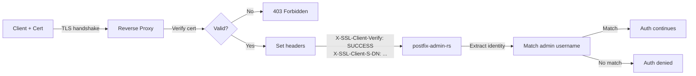

> **Language:** English | [Francais](../fr/features/04-authentication/admin-authentication.md)

# SPEC-04.1 — Administrator Authentication

## Implementation Status

| Component                                            | Crate                | Status  | Milestone |
|------------------------------------------------------|----------------------|---------|-----------|
| Models (`Admin`, `DomainAdmin`)                      | `postfix-admin-core` | Done    | M1        |
| DTOs (`CreateAdmin`, `UpdateAdmin`, `AdminResponse`) | `postfix-admin-core` | Done    | M1        |
| DTOs (`CreateDomainAdmin`, `DomainAdminResponse`)    | `postfix-admin-core` | Done    | M1        |
| Repository trait (`AdminRepository`)                 | `postfix-admin-core` | Done    | M1        |
| PostgreSQL repository                                | `postfix-admin-db`   | Done    | M2        |
| MySQL repository                                     | `postfix-admin-db`   | Done    | M2        |
| Password hashing and verification                    | `postfix-admin-auth` | Done    | M4        |
| JWT generation and verification                      | `postfix-admin-auth` | Done    | M4        |
| Session management (HttpOnly, Secure, SameSite)      | `postfix-admin-auth` | Done    | M4        |
| CSRF token generation and validation                 | `postfix-admin-auth` | Done    | M4        |
| Rate limiting and brute-force protection             | `postfix-admin-auth` | Done    | M4        |
| TOTP generation, verification, recovery codes        | `postfix-admin-auth` | Done    | M4        |
| mTLS client certificate extraction                   | `postfix-admin-auth` | Done    | M4        |
| mTLS middleware integration (per-role enforcement)    | `postfix-admin-api`  | Done    | M4        |
| Web UI login page                                    | `postfix-admin-web`  | Done    | M6        |

## Summary

Authentication system for administrator accounts (superadmin and domain admin).
Web form authentication with server-side session, optional TOTP 2FA support.

## Entity: `Admin`

| Field            | Type           | Constraint                | Description              |
|------------------|----------------|---------------------------|--------------------------|
| `username`       | `VARCHAR(255)` | PK                        | Admin identifier (email) |
| `password`       | `VARCHAR(255)` | NOT NULL                  | Password hash            |
| `superadmin`     | `BOOLEAN`      | NOT NULL, default `false` | Superadmin privilege     |
| `totp_secret`    | `VARCHAR(255)` | NULLABLE                  | Encrypted TOTP secret    |
| `totp_enabled`   | `BOOLEAN`      | NOT NULL, default `false` | 2FA enabled              |
| `token`          | `VARCHAR(255)` | NULLABLE                  | Password recovery token  |
| `token_validity` | `TIMESTAMPTZ`  | NULLABLE                  | Token expiration         |
| `active`         | `BOOLEAN`      | NOT NULL, default `true`  | Account active/inactive  |
| `created_at`     | `TIMESTAMPTZ`  | NOT NULL, default `now()` | Creation date            |
| `updated_at`     | `TIMESTAMPTZ`  | NOT NULL, default `now()` | Last modification        |

### Associated Entity: `DomainAdmin`

| Field        | Type           | Constraint                | Description         |
|--------------|----------------|---------------------------|---------------------|
| `username`   | `VARCHAR(255)` | FK → `admin.username`     | Admin identifier    |
| `domain`     | `VARCHAR(255)` | FK → `domain.domain`      | Administered domain |
| `created_at` | `TIMESTAMPTZ`  | NOT NULL, default `now()` | Assignment date     |

Composite PK: `(username, domain)`

## Authentication Flow

```
┌─────────┐     ┌──────────────┐     ┌──────────────┐     ┌────────────┐
│  Login  │────▶│ Vérification │────▶│  TOTP 2FA ?  │────▶│  Session   │
│  Form   │     │  Password    │     │  (if enabled)│     │  Created   │
└─────────┘     └──────────────┘     └──────────────┘     └────────────┘
                       │                     │
                       ▼                     ▼
                 ┌──────────┐          ┌──────────┐
                 │  Failure │          │  Failure │
                 │  (log)   │          │  (log)   │
                 └──────────┘          └──────────┘
```

## Business Rules

### Login (BR-AUTH-01)
- Verification of username/password pair
- If the hash uses an old schema and authentication succeeds → transparent rehashing
- Account `active = false` → refusal with generic message
- Rate limiting: 5 attempts max per IP over 15 minutes (configurable)
- Log of each attempt (success and failure)

### Session (BR-AUTH-02)
- Server-side session (HttpOnly, Secure, SameSite=Strict cookie)
- Configurable session duration (default: 1 hour)
- Regeneration of session ID after authentication (session fixation prevention)
- Automatic invalidation after inactivity
- Session storage: in memory (default) or Redis (optional)

### Password Recovery (BR-AUTH-03)
- Generation of a random token (256 bits, base64url encoded)
- Token validity: 1 hour (configurable)
- Email sent via local SMTP server
- The token is hashed in the database (we don't store it in plain text)
- Only one active token per admin at a time

### Brute-force Protection (BR-AUTH-04)
- Failure counter by IP and username
- After N failures → progressive delay (1s, 2s, 4s, 8s...)
- After M failures → temporary IP block (15 min)
- Blocking information is in memory (not in database)
- `X-Forwarded-For` header respected if configured (reverse proxy)

### Client Certificate Authentication (BR-AUTH-05)
- Optional mTLS factor for administrator accounts (superadmin, domain admin)
- Certificate verification is performed by the reverse proxy (Nginx/Apache)
- The proxy forwards identity information via HTTP headers
- The application extracts the admin identity from the certificate subject DN
- Configurable per role: can require certificates for superadmin only, or all admins
- Certificate identity (emailAddress field) must match the admin username
- Does not replace password + TOTP — adds an additional authentication factor



#### Configuration

```toml
[auth.mtls]
enabled = true
trusted_proxy_header = "X-SSL-Client-Verify"
subject_header = "X-SSL-Client-S-DN"
serial_header = "X-SSL-Client-Serial"
require_for_superadmin = true
require_for_domain_admin = false
cn_field = "emailAddress"
```

## Use Cases

### UC-AUTH-01: Admin Login
- **Input**: username, password
- **Output**: Session created, redirect to dashboard — or TOTP page if 2FA is enabled

### UC-AUTH-02: Logout
- **Input**: User action
- **Output**: Session destroyed, redirect to login

### UC-AUTH-03: Password Recovery
- **Input**: Admin email address
- **Output**: Email with reset link (if the account exists)
- **Security**: Same response whether the account exists or not (timing-safe)

### UC-AUTH-04: Password Reset
- **Input**: Token + new password (x2)
- **Validation**: Valid and non-expired token

## Web Routes

| Route                     | Method | Description       |
|---------------------------|--------|-------------------|
| `/login`                  | GET    | Login form        |
| `/login`                  | POST   | Login processing  |
| `/logout`                 | POST   | Logout            |
| `/password-recover`       | GET    | Recovery form     |
| `/password-recover`       | POST   | Token sending     |
| `/password-reset/{token}` | GET    | New password form |
| `/password-reset/{token}` | POST   | Reset processing  |

## API Endpoints

| Method | Route                      | Description                  |
|--------|----------------------------|------------------------------|
| `POST` | `/api/v1/auth/login`       | Authentication (returns JWT) |
| `POST` | `/api/v1/auth/logout`      | Token invalidation           |
| `POST` | `/api/v1/auth/refresh`     | Token refresh                |
| `POST` | `/api/v1/auth/totp/verify` | TOTP verification            |

## Security Notes

- Error messages do not distinguish between "unknown user" and "wrong password"
- Password comparisons are timing-safe
- Session and recovery tokens use a CSPRNG
- CSRF protection on all POST forms
